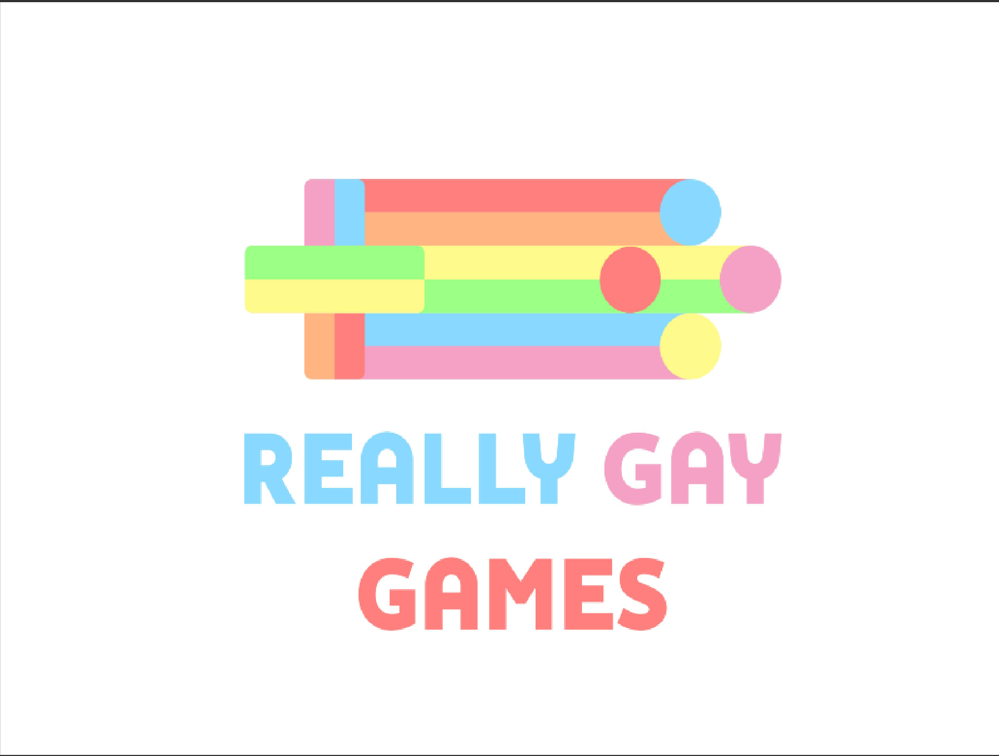
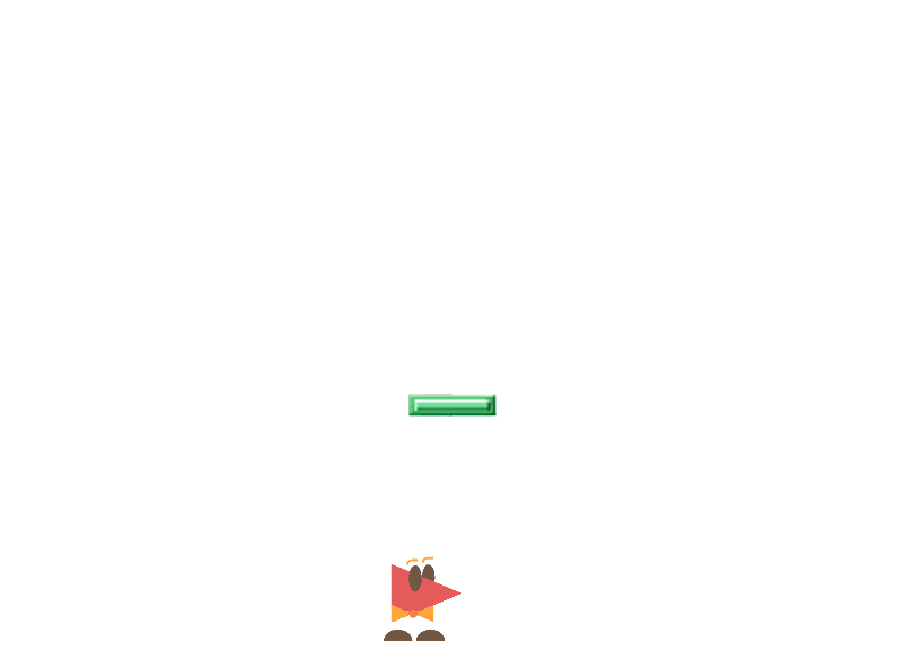

# RGG-Thistle
2d platform game created using unity. Made to be played on PC (Linux, mac, windows)

### Online video link
[Current Progress Video](https://youtu.be/NToBq2zpr2Y)

This is Thistle's main game and is a 2D platform concept. We have a variety of concept interactions. A few of the levels were designed. This was just dipping my toes into animations and colliders in unity. Right now this concept only supports jumping, walking, left and right movement. This also utilizes 2d colliders to interact with the walls of the game and the objects in the scene.

#### Images of UI

#### Website
[Really Gay Games](reallygay.games)

#### Disclaimer
I do not own any of the artwork, it was created by Christian. 
I worked on all the code and software of Really Gay Games.
